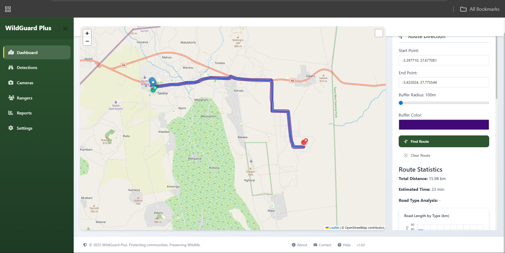

# WildGuard Plus

[](https://opensource.org/licenses/MIT)
[](https://www.python.org/)
[](https://flask.palletsprojects.com/)

## 🌍 Overview
WildGuard Plus is an AI-Powered Early Warning System designed to mitigate human-wildlife conflict in Taita Taveta County, Kenya. The system uses machine learning to detect approaching wildlife (particularly elephants and antelopes) and sends instant alerts to relevant authorities and community members, enabling timely response to prevent conflicts.

## 🚀 Key Features

- **Real-time Wildlife Detection**: AI-powered detection of elephants and antelopes
- **Instant Alerts**: SMS and in-app notifications to rangers and community members
- **Interactive Dashboard**: Live mapping of wildlife movements and detection zones
- **Incident Reporting**: Track and manage human-wildlife conflict incidents
- **Ranger Coordination**: Tools for managing ranger teams and responses
- **Comprehensive Analytics**: Data-driven insights into wildlife patterns

## 📸 Screenshots


*Figure 1: WildGuard Plus Dashboard*

## 🛠️ Tech Stack

- **Backend**: Python, Flask
- **Frontend**: HTML5, CSS3, JavaScript, Bootstrap 5, MapLibre GL
- **Database**: SQLite (Development), PostgreSQL (Production)
- **AI/ML**: Custom-trained YOLO model for wildlife detection
- **Maps**: MapLibre GL for interactive mapping
- **Deployment**: Docker, Nginx

## 🚀 Getting Started

### Prerequisites
- Python 3.8+
- pip (Python package manager)
- Git

### Installation

1. **Clone the repository**
   ```bash
   git clone https://github.com/Chaser-254/WildGuard_Plus-MVP.git
   cd WildGuard_Plus-MVP
   ```

2. **Create and activate a virtual environment**
   ```bash
   python -m venv venv
   source venv/bin/activate  # On Windows: .\venv\Scripts\activate
   ```

3. **Install dependencies**
   ```bash
   pip install -r requirements.txt
   ```

4. **Set up environment variables**
   Create a `.env` file in the root directory:
   ```
   FLASK_APP=run.py
   FLASK_ENV=development
   SECRET_KEY=your-secret-key-here
   DATABASE_URL=sqlite:///wildguard.db
   ```

5. **Initialize the database**
   ```bash
   flask db init
   flask db migrate
   flask db upgrade
   ```

6. **Run the application**
   ```bash
   flask run
   ```

7. **Access the application**
   Open your browser and navigate to `http://localhost:5000`

## 🌐 Project Structure

```
WildGuard_Plus-MVP/
├── app/
│   ├── __init__.py
│   ├── models/
│   ├── routes/
│   │   ├── __init__.py
│   │   ├── dashboard.py
│   │   ├── pages.py
│   │   └── ...
│   ├── static/
│   │   ├── css/
│   │   ├── js/
│   │   └── images/
│   └── templates/
│       ├── base.html
│       ├── dashboard.html
│       ├── pages/
│       └── ...
├── migrations/
├── tests/
├── .env.example
├── .gitignore
├── config.py
├── requirements.txt
└── run.py
```

## 🤝 Contributing

We welcome contributions! Please follow these steps:

1. Fork the repository
2. Create a new branch (`git checkout -b feature/AmazingFeature`)
3. Commit your changes (`git commit -m 'Add some AmazingFeature'`)
4. Push to the branch (`git push origin feature/AmazingFeature`)
5. Open a Pull Request

## 📄 License

This project is licensed under the MIT License - see the [LICENSE](LICENSE) file for details.

## 📧 Contact

For more information, please contact:
- **Email**: info@wildguardplus.org
- **Website**: [www.wildguardplus.org](https://www.wildguardplus.org)
- **Location**: Taita Taveta, Kenya

## 🙏 Acknowledgments

- Kenya Wildlife Service (KWS)
- Local communities of Taita Taveta
- All contributors and supporters

---

<div align="center">
  Made with ❤️ in Kenya | © 2025 WildGuard Plus
</div>